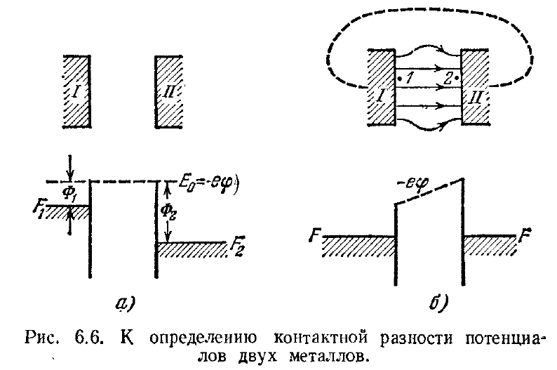

Омический контакт - это материал с линейной ВАХ, который создается между полупроводником и металлом для выравнивания уровня потенциальных барьеров металла и полупроводника
В Бонч-Бруевиче это страницы от 212 (контактная разность потенциалов)

Суть:

Суть находится в таком явлении, как "контактная разность потенциалов"
на картинке можно увидеть смысл

 Термоэлектронная работа выхода металла $I$ есть $\Phi_1 = E_0 - F_1$, а металла $II$ $\Phi_2 = E_0 - F_2$. При соединении обоих тел проводником устанавливается электронное равновесие и уровни Ферми $F_1$ и $F_2$ уравниваются. Но при этом вершины потенциальных ям уже оказываются на разной
 высоте, и по этому потенциальная энергия электрона $e\Phi$ как функцияя координат уже не изображается горизонтальной прямой. 

### Толщина потенциального барьера в контактах
Полупроводник будем считать невырожденным n типа. Нахождение распределения потенциала и концентрации электронов:

выражение для плотности тока

$$j = en\mu\mathcal{E} + \mu kT \frac{dn}{dx},$$

уравнение Пуассона

$$\frac{\partial\mathcal{E}}{\partial x} = \frac{4\pi\rho}{\varepsilon}$$

и уравнение непрерывности

$$\frac{\partial\rho}{\partial t} = -\frac{\partial j}{\partial x}.$$

Пусть далее полупроводник содержит доноры с концентрацией $Nd$ и акцепторы с концентрацией $Na<Nd$. Тогда плотность объемного заряда $\rho = e(N_d^+ - N_a^- - n)$

$J = const$

при $E = -grad(\varphi)$

$$j = -en\mu \frac{d\varphi}{dx} + \mu kT \frac{dn}{dx},$$

$$\frac{d^2\varphi}{dx^2} = \frac{4\pi e}{\varepsilon}(n - n_0).$$

А граничная концентрация $n_k$ в остутствие тока есть заданная характеристика контакта, которая зависит от природы металла и полупроводника

$n_k = n_0exp(-\frac{eu_k}{kT})$

найдем $n$ из соотношения для тока
$0= -en\mu \frac{d\varphi}{dx} + \mu kT \frac{dn}{dx},$

$en\mu \frac{d\varphi}{dx}=  \mu kT \frac{dn}{dx},$

$\mu kT {dn} = en\mu {d\varphi},$

${dn}/n = e/kT {d\varphi},$

Интегрируем и получаем:
$n = Cexp(\frac{e\varphi}{kT})$

Из граничных условий, которые представляют собой

$x = 0,   \varphi=0,     n = n_k$ 

$x = \infty ,   \varphi=u_k+u, n = n_0$ 

мы честно находим C

$n_k = Cexp(\frac{e0}{kT}) => C = n_k$

$n_0 = n_k exp(\frac{e\varphi}{kT})$

$\frac{d^2\varphi}{dx^2} = \frac{4\pi e}{\varepsilon} n_k \left( \exp \frac{e\varphi}{kT} - \exp \frac{eu_k}{kT} \right) = \frac{4\pi e}{\varepsilon} n_0 \left( \exp \frac{e(\varphi - u_k)}{kT} - 1 \right) \quad$

Из этого уравнения мы будем искать толщину потенциального барьера в контактах.

Один из возможных вариантов нахождения этой ширины - это приближение Шоттки( Контакт металл полупроводник).
Её постулаты:

1.Полное обеднение. В ОПЗ( от x = 0, до x = W) концентрация свободных носителей заряда пренебрежимо мала по сравнению с концентрацией примеси.

2.Пусть так же к контакту приложено внешнее напряжение u, которое создает обедненный слой( именно оно и "выгоняет" все основные носители заряда)

3. Считается соответственно, что в области W электронов нет вовсе из-за поля u. $eu_k>0$ (запорный слой) 

Для этого приближения мы берем x = W, $\varphi = u_k + u$

$exp(\frac{e(\varphi-u_k)}{kT})<<1$

и тогда: $\frac{d^2\varphi}{dx^2}=\frac{4 \pi e n_0}{\varepsilon}=const$

### Решение уравнения Пуассона (Приближение Шоттки)

Запишем исходное уравнение для области обеднения ($0 < x < W$), полагая подвижные носители отсутствующими ($n \approx 0$):

$$\frac{d^2\varphi}{dx^2} = -\frac{4\pi e n_0}{\varepsilon} = \text{const}.$$

**1. Первое интегрирование (находим электрическое поле):**
Используем граничное условие: на краю области обеднения ($x = W$) поле исчезает 

$\frac{d\varphi}{dx} = 0$.

$$\frac{d\varphi}{dx} = \frac{4\pi e n_0}{\varepsilon} (W - x).$$

**2. Второе интегрирование (находим потенциал):**

Используем граничное условие на контакте: при $x = 0$ потенциал $\varphi = 0$.

$$\varphi(x) = \frac{4\pi e n_0}{\varepsilon} \left( Wx - \frac{x^2}{2} \right).$$

**3. Определение ширины барьера ($W$):**

Используем условие в глубине полупроводника ($x = W$): потенциал равен контактной разности 

плюс внешнее напряжение ($\varphi = u_k + u$).

$$u_k + u = \frac{4\pi e n_0}{\varepsilon} \cdot \frac{W^2}{2}.$$

Отсюда выражаем ширину области пространственного заряда:

$$W = \sqrt{ \frac{\varepsilon (u_k + u)}{2\pi e n_0} }.$$

Вот на этом, собственно, все.
